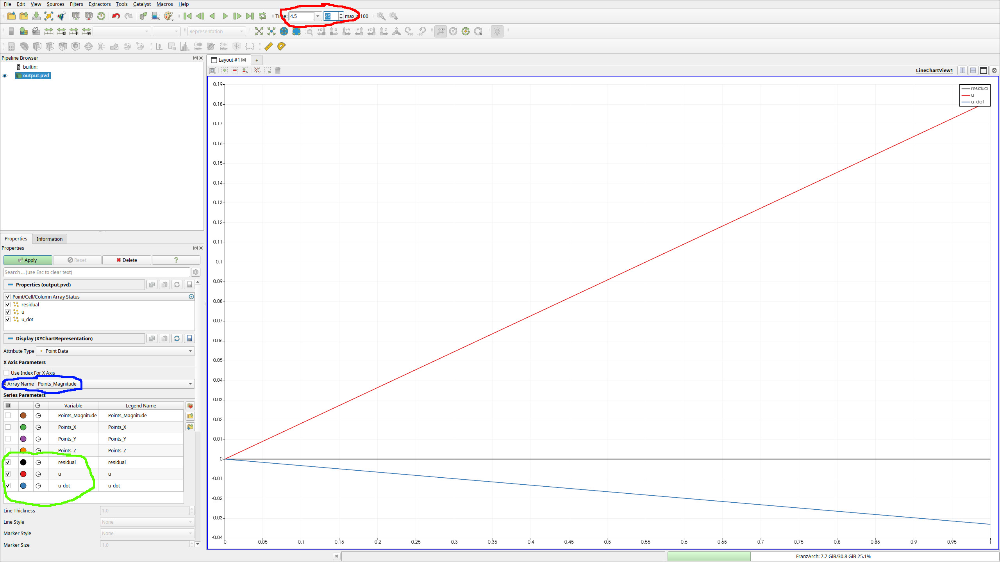

# Tutorial 1: Creating an Application {#tut1}

This first tutorial will guide you through the process of setting up a new application using the DiFfRG. This first program will simply solve a hydrodynamic equation unrelated to fRG, but introduce the basic structure of a typical DiFfRG application.

You can find the full code as described here also in `Tutorials/tut1`.

## File structure

We will start by creating a new directory in the `Applications` directory just below the `DiFfRG` top directory. This directory will contain all the files necessary for the simulation.

```bash
$ cd Applications
$ mkdir tut1
$ cd tut1
$ touch CMakeLists.txt
$ touch tut1.cc
$ touch model.hh
$ touch parameters.json
```

- The `CMakeLists.txt` file is used to tell CMake how to build the project.
- The `tut1.cc` file contains the main function of the simulation and the most general structure of the simulation.
- In the `model.hh` file we will define the numerical model, i.e. the set of differential equations that we want to solve.
- The `parameters.json` file will contain the parameters for the simulation.

## CMake setup

The `CMakeLists.txt` file is the first thing we need to set up. [CMake](https://www.cmake.org) is a powerful build system which automates complex setup of dependencies and structure of C++ programs. For a deeper understanding, please consult the [documentation](https://cmake.org/cmake/help/latest/) and see the `DiFfRG` build system setup in `DiFfRG/cmake/setup_build_system.cmake`.

In our case, we need to tell CMake about our new simulation and about the `DiFfRG` library. In practice, our `CMakeLists.txt` file looks as in the following:
```CMake
cmake_minimum_required(VERSION 3.26.4)

project(tut1)
```
In the above, we first request a minimum version of `CMake` and then declare our project.
```CMake
find_package(DiFfRG REQUIRED HINTS /opt/DiFfRG)
```
Afterwards, we request `CMake` to find the `DiFfRG` package. We set the default install path here, which is `/opt/DiFfRG`, but depending on where you installed `DiFfRG`, you will have to change this.
```
add_executable(tut1 tut1.cc)
setup_application(tut1)
```
Finally, we register an executable with `CMake` (called tut1) and use the `setup_application` function, which is a part of `DiFfRG`. It sets up all dependencies necessary for a `DiFfRG`-application, sets header paths and links it against the `DiFfRG` library.

With this set up, we can immediately create our build directory and test the build system. To that end, create a new directory and enter it,
```bash
$ mkdir build
$ cd build
```
Then, invoke cmake,
```
$ cmake -DCMAKE_BUILD_TYPE=Release -DCMAKE_CXX_FLAGS='-O3 -march=native -ffast-math -fno-finite-math-only' ..
```
Here, we tell CMake to create an optimized "Release" build and propagate some further optimization flags to the compiler. The last argument to the `cmake` command, `..`, tells it where the source files can be found. In this case, it finds the `CMakeLists.txt` we just created in the parent directory and uses it to set up the build system.

At this point you could already invoke the build system by running
```bash
$ make -j8
```
which will build the whole project using 8 cores. However, doing this will at this stage only lead to a linker error, as the `tut1.cc` file does not contain anything yet. In particular, the program lacks an entry point, i.e. a `main` function.

## tut1.cc

Now we are ready to set up the main structure of the program in `tut1.cc`.

```Cpp
#include <DiFfRG/common/configuration_helper.hh>
#include <DiFfRG/common/utils.hh>
#include <DiFfRG/discretization/discretization.hh>
#include <DiFfRG/timestepping/timestepping.hh>

#include "model.hh"

using namespace DiFfRG;

int main(int argc, char *argv[])
{
```
The includes in the first few rows are parts of the `DiFfRG` and we will use them in a moment to set up the simulation. Next, we include the `model.hh` file, where we will set up the actual system of equations to solve.

All relevant classes and functions are in the `DiFfRG` master namespace, so for convenience we just import all symbols from this namespace into our code by `using namespace DiFfRG;`.

The actual program logic starts with the entry point, the `main` function. The first thing to do in the `main` function is to read the parameter file `parameters.json` we created earlier:
```Cpp
  // get all needed parameters and parse from the CLI
  ConfigurationHelper config_helper(argc, argv);
  const auto json = config_helper.get_json();
```
The `ConfigurationHelper` class automatically chooses the correct parameter file; if the executable is invoked with the `-p` parameter, i.e. `./tut1 -p parameters.json`, the argument of `-p` is chosen as the parameter file. Otherwise, `ConfigurationHelper` will try to open a file called `parameters.json` in the current working directory. The parameters have to be specified in the [JSON](https://www.json.org/json-en.html) format.

In order for this class to parse the flags and arguments passed from the command line, we need to construct the object with the `argc, argv` parameters, which hold this information.
Afterwards, we load the entire parameter structure into the `json` variable, which has the same structure as the original json file.

After setting up the configuration, we choose the algorithms used in our simulation. To do so, we make some convenient type aliases with the chosen class types:
```Cpp
  // Choices for types
  using Model = Tut1;
  constexpr uint dim = Model::dim;
  using Discretization = CG::Discretization<Model::Components, double, RectangularMesh<dim>>;
  using VectorType = typename Discretization::VectorType;
  using SparseMatrixType = typename Discretization::SparseMatrixType;
  using Assembler = CG::Assembler<Discretization, Model>;
  using TimeStepper = TimeStepperSUNDIALS_IDA<VectorType, SparseMatrixType, dim, UMFPack>;
```
After making an alias for the numerical model, which we will specify in a moment, we choose a spatial (field space) dimension, which is here simply taken from the Model.

The `Discretization` gives a prescription to discretize the field space. Here, we choose the `CG`, i.e. *Continuous Galerkin* discretization and accordingly a fitting `Assembler`. The assembler, as the name implies, assembles the system of equations to be solved. In practice, the differential equation you specify in the `Model` is discretized by the `Assembler` using the `Discretization` and brought into the form of a time-dependent, nonlinear ODE (ordinary differential equation)
\f[
  F(\partial_t v_i, v_i) = 0\,,
\f]
where \f$v_i\f$ are the components of the discretization. The `Assembler` is directly invoked by the `TimeStepper` which requests the construction of the above equation at every (RG) time step and evolves the system according to it.
If you are unfamiliar with [FEM](https://en.wikipedia.org/wiki/Finite_element_method) methods, it would be recommended to at least understand the basics of it.

Next, we choose the [*SUNDIALS_IDA*](https://computing.llnl.gov/projects/sundials/ida) timestepper, which is the most performant choice for FEM setups with spontaneous symmetry breaking. IDA is a differential-algebraic solver, i.e. it solves both equations dependent on time, as above,
\f[
  F(\partial_t v_i, v_i) = 0\,,
\f]
but also stationary (secondary) equations without explicit dependence on time derivatives,
\f[
  G(v_i) = 0\,.
\f]
We will show the utility of this in a later tutorial.
Note that the TimeStepper takes an additional argument, where we can choose the linear solver. The direct solver `UMFPack` is a simple but good choice, as it solves any linear system exactly. However, with large systems, e.g. in \f$d\geq2\f$, `GMRES` or another iterative solver is usually much faster and thus preferred.

```Cpp
  // Define the objects needed to run the simulation
  Model model(json);
  RectangularMesh<dim> mesh(json);
  Discretization discretization(mesh, json);
  Assembler assembler(discretization, model, json);
  TimeStepper time_stepper(json, &assembler);
```
We now use the types we defined above to construct objects of all the classes described above.

With everything prepared, we are now ready to set up and run the equation system. To do so, we create an initial condition on the discretization (i.e. FEM space) we set up before,
```Cpp
  // Set up the initial condition
  FE::FlowingVariables initial_condition(discretization);
  initial_condition.interpolate(model);
```
and use it to run the time-stepper from RG-time 0 to the final RG-time, which we infer from the parameter file:
```Cpp
  // Now we start the timestepping
  Timer timer;
  try {
    time_stepper.run(&initial_condition, 0., json.get_double("/timestepping/final_time"));
  } catch (std::exception &e) {
    spdlog::get("log")->error("Simulation finished with exception {}", e.what());
    return -1;
  }
  auto time = timer.wall_time();
```
Note here, that RG-time is defined on the level of the code as positive, i.e.
\f[
  t_+ = \ln \Lambda / k
\f]
whereas the usual convention is
\f[
  t_- = \ln k / \Lambda
\f]
Furthermore, we recorded the time the simulation took using the `dealii::Timer` class.

We finish the program by printing a bit of information to the log file, in particular the performance and utilization of the `Assembler`.
```Cpp
  // We print a bit of exit information.
  assembler.log("log");
  spdlog::get("log")->info("Simulation finished after " + time_format(time));
  return 0;
}
```

## model.hh

Now we need to specify the equation system to solve. For this example, we will just implement Burgers' equation, which is not fRG-related but a simple hydrodynamic equation given by
\f[
  \partial_t u(x,t) + \frac12 \partial_x u(x,t)^2 = 0
\f]

First things first, we set a few things up before we get to the equation system:
```Cpp
#pragma once

#include <DiFfRG/model/model.hh>

using namespace DiFfRG;

struct Parameters {
  Parameters(const JSONValue &value)
  {
    try {
      a = value.get_double("/physical/a");
      b = value.get_double("/physical/b");
      c = value.get_double("/physical/c");
      d = value.get_double("/physical/d");
    } catch (std::exception &e) {
      std::cout << "Error in reading parameters: " << e.what() << std::endl;
    }
  }
  double a, b, c, d;
};
```
Although not necessary in this case, the `#pragma once` compiler directive ensures that the header file is not included multiple times (similar to the use of include guards), which would lead to compiler errors.
The `DiFfRG/model/model.hh` header contains basic predefines necessary for the setup of a numerical model. Again, we import all symbols from the `DiFfRG` namespace.

Afterwards, we create a struct to hold parameters we read once from the `JSON` variable. We call these a,b,c,d and will use them to construct the initial condition for the differential equation, i.e. \f$u(x,0)\f$.

With this in place, let's set the equation system structure up:
```Cpp
using FEFunctionDesc = FEFunctionDescriptor<Scalar<"u">>;
using Components = ComponentDescriptor<FEFunctionDesc>;
constexpr auto idxf = FEFunctionDesc{};
```
Our system is very small, consisting only of a single equation. With large fRG simulations this can grow however extremely large, using momentum grids of variables and large vertex expansions. Thus, `DiFfRG` provides a mechanism of describing these systems and smartly indexing the numerical degrees of freedom. Here, we use a descriptor to tell the library how many and what kinds of functions we have. We use one function which lives on a FEM discretization and thus use the `FEFunctionDescriptor` with one `Scalar` which we call "u" as in the above equation.

If we had two variables, e.g. another one called \f$v\f$, we would declare this as
`FEFunctionDescriptor<Scalar<"u">, Scalar<"v">>;`. We will treat the declaration of larger systems in a later tutorial in-detail.

The `ComponentDescriptor` type packs the `FEFunctionDescriptor` together with other parts of the equation system; here, we only have a FE function and thus do not provide more template parameters.
Creating a compile-time constant (`constexpr`) object of the descriptor is useful for easier access to the indices, which we will use below.

```Cpp
/**
 * @brief This class implements the numerical model for Burgers' equation.
 */
class Tut1 : public def::AbstractModel<Tut1, Components>,
             public def::fRG,                  // this handles the fRG time
             public def::FlowBoundaries<Tut1>, // use Inflow/Outflow boundaries
             public def::AD<Tut1>              // define all jacobians per AD
{
```
Now we define the actual numerical model. We need to derive the class from `def::AbstractModel`, which defines all necessary methods so our numerical model can be used by the `Assembler`. Here, we also communicate the structure of our equation system through the `Components` type we declared earlier. Furthermore, we derive from a few more classes:
- `def::fRG` provides a method where \f$t\f$ is automatically communicated to the model and the RG-scale \f$k\f$ is computed from it. Furthermore, it defines the variables `t` and `k` which can be directly used in the code.
- `def::FlowBoundaries` is necessary to close the FEM system, as the boundary conditions at \f$x=0\f$ and \f$x = x_\textrm{max}\f$ need to be specified. `def::FlowBoundaries` sets up inflow/outflow boundary conditions.
- `def::AD` creates methods for the automatic evaluation of jacobians of our system, i.e.
\f[
  \frac{\partial (\partial_t u - \frac12 \partial_x u^2)}{\partial u}\,\qquad\text{and}\qquad
  \frac{\partial (\partial_t u - \frac12 \partial_x u^2)}{\partial (\partial_t u)}\,.
\f]
This is achieved by the use of [automatic differentiation](https://en.wikipedia.org/wiki/Automatic_differentiation), using the [autodiff](https://autodiff.github.io/) library. This is also the reason why we must template and not use explicit types in the methods of the numerical model, as will be seen below.

```Cpp
private:
  const Parameters prm;

public:
  static constexpr uint dim = 1;

  Tut1(const JSONValue &json) : def::fRG(json.get_double("/physical/Lambda")), prm(json) {}
```
Here, we have only written the constructor, communicated \f$\Lambda\f$ to the `def::fRG` base class and created a `Parameters` object.

```Cpp
  template <typename Vector> void initial_condition(const Point<dim> &pos, Vector &values) const
  {
    const auto x = pos[0];
    values[idxf("u")] = prm.a + prm.b * powr<1>(x) + prm.c * powr<2>(x) + prm.d * powr<3>(x);
  }
```
The `initial_condition` method is invoked by the `initial_condition.interpolate(model)` call from above. We use the parameters `a,b,c,d` to set up a polynomial initial condition. Here, we also use the indexing provided by the `FEFunctionDescriptor` class, to retrieve the position of "u" within the array of FE functions. In this case, it is of course trivial, as `idxf("u")` always evaluates to `0`. Note however, that the lookup is done statically at compile time and is thus much faster than dynamic lookup, such as with a `std::map`.

```Cpp
  template <typename NT, typename Solution> void flux(std::array<Tensor<1, dim, NT>, Components::count_fe_functions(0)> &F_i, const Point<dim> &/*x*/, const Solution &sol) const
  {
    const auto &fe_functions = get<"fe_functions">(sol);

    const auto u = fe_functions[idxf("u")];

    F_i[idxf("u")][0] = 0.5 * powr<2>(u);
  }
};
```
The `flux` method implements the actual equation. If we don't specify anything else, the `Assembler` will construct the equation
\f[
  \partial_t u + \partial_x (F_i(u)) = 0
\f]
so that our choice of \f$F_i(u) = \frac12 u^2\f$ exactly implements Burgers' equation.

## parameters.json

The parameter file contains usually user-defined quantities in a "physical" subsection and further paramters for the backend:

```JSON
{
  "physical": {
    "Lambda" : 1.0,
    "a" : 0.0,
    "b" : 1.0,
    "c" : 0.0,
    "d" : 0.0
  },
```
These sections are just the parameters we also use in the numerical model, i.e. user-space parmeters.
```JSON
  "discretization": {
    "fe_order": 3,
    "threads": 8,
    "batch_size": 64,
    "overintegration": 0,
    "output_subdivisions": 2,

    "EoM_abs_tol": 1e-10,
    "EoM_max_iter": 100,

    "grid": {
      "x_grid": "0:1e-2:1",
      "y_grid": "0:0.1:1",
      "z_grid": "0:0.1:1",
      "refine": 0
    },
```
The discretization section configures the FEM setup of our simulation:
- `fe_order` sets the polynomial order of the local function space on the finite elements
- `threads` sets the number of CPU threads used for assembly. Note, that other multithreading parts of `DiFfRG`, such as momentum integration, automatically use all available CPU threads and ignore this parameter.
- `batch_size` the assembly threads get batches of `batch_size` which they sequentially process. Playing around with `threads` and `batch_size` may give a small performance boost, but keeping `threads` around the number of physical cores and `batch_size` around 32-64 should be sufficient for almost optimal performance.
- `overintegration` can be used to increase the order of the quadratures used in assembly when constructing the [weak form](https://en.wikipedia.org/wiki/Weak_formulation) of the PDE. It is seldom necessary to increase beyond 0.
- `output_subdivisions` gives the precision with which the grids in the output data are written. This goes exponentially, so don't choose it too high.
- `EoM_abs_tol` sets the absolute precision within which a specified equation of motion is solved. DiFfRG can be instructed to solve the EoM at every timestep and perform additional computations at this point.
- `EoM_max_iter` sets the number of bisections used in determining the position of the EoM.
- `x_grid` this works in a python-like slice syntax and sets the  used in a `RectangularMesh`. The parameter also supports locally different cell sizes: "0:1e-4:1e-2, 1e-2:1e-3:1" creates 100 cells between 0 and 1e-2, and 100 cells between 1e-2 and 1.
- `y_grid` and `z_grid` work identically, but are only used in 2D / 3D simulations.
- `refine` can be used to quickly increase the cell count by \f$2^\textrm{refine}\f$.
```JSON
    "adaptivity": {
      "start_adapt_at": 0E0,
      "adapt_dt": 1E-1,
      "level": 0,
      "refine_percent": 1E-1,
      "coarsen_percent": 5E-2
    }
  },
```
The adaptivity section sets parameters for adaptive refinement of the discretization mesh. As we have not set this up in the numerical model, we will postpone the explanation of this section to a later tutorial.
```JSON
  "timestepping": {
    "final_time": 10.0,
    "output_dt": 1E-1,
    "explicit": {
      "dt": 1E-4,
      "minimal_dt": 1E-6,
      "maximal_dt": 1E-1,
      "abs_tol": 0.0,
      "rel_tol": 1E-3
    },
    "implicit": {
      "dt": 1E-4,
      "minimal_dt": 1E-6,
      "maximal_dt": 1E-1,
      "abs_tol": 1E-13,
      "rel_tol": 1E-7
    }
  },
```
The timestepping section controls the behavior of the `Timestepper` class:
- `final_time` sets the end-time of the simulation - this is actually not a required parameter, but one we use in our call to `timestepper.run(...)`
- `output_dt` sets the intervals within which we write the solution to disk. Note, that the timesteppers do not necessarily step exactly onto `output_dt` intervals, but interpolate the solution to the output times.
- The `explicit` and `implicit` sections control the behavior of explicit and implicit timesteppers respectively. The disctinction exists, because some timesteppers actually run part of the equation system explicitly and another implicitly. Usually, the FEM part is always implicit and further components of the expansion can be chosen to evolve explicitly.
  - `dt` is the initial timestep for adaptive timesteppers and the fixed timestep for non-adaptive ones.
  - `minimal_dt` and `maximal_dt` set the bounds for the timestep size - if an adpative stepper goes above or below, the step is adjusted to the bound, if the timestepper gets stuck below `mminimal_dt`, time evolution is aborted.
  - `abs_tol` and `rel_tol` set absolute and relative error tolerance for the timestepping. While the FE parts of the system usually require a higher precision (< 1e-7 relative precision), especially in the presence of spontaneaous symmetry breaking, explicit tolerances can be chosen much more freely.
For more information about timesteppers and their relationship with spontaneous symmetry breaking in fRG, see also [this paper](https://arxiv.org/abs/2302.04736).

```JSON
  "output": {
    "verbosity": 0,
    "folder": "./",
    "name": "output"
  }
}
```
The `output` section defines:
- `verbosity` sets how much information is being written to console while running. If at 0, no information is written at all, whereas at 1 the system gives updates at every timestep.
- `folder` sets the base folder where data is stored. This is useful to not clutter your current directory ("./") with output, or if you run a large amount of simulations.
- `name` sets the beginning of all filenames of the output, i.e. in this case all files created by the simulation start with "output".

## Running it

To run the simulation, first build it,
```bash
$ make
```
and then directly run it through
```
$ ./tut1 -p ../parameter.json -si /output/verbosity=1
```
We made use here of a mechanism to override the parameters of a simulation. The flag -p selects the parameter file to be used.
By default it looks for a parameter.json in the current directory. One can use the flags `-si` to set an integer, `-ss`
to set a string and `-sd` to set a double (floating-point) value, followed by the full path to the parameter and its
value after an equality symbol.

After the simulation has run, which should take (depending on your computer) a few seconds, a few files have been created in the current folder, which you can look up by
```bash
$ ls -l
```
- `output.log` contains logging information:
```bash
$ cat output.log
[2024/10/11] [23:01:31] [DiFfRG Application started]
[2024/10/11] [23:01:31] [FEM: Number of active cells: 100]
[2024/10/11] [23:01:31] [FEM: Number of degrees of freedom: 301]
[2024/10/11] [23:01:31] [FEM: Using 8 threads for assembly.]
[2024/10/11] [23:01:32] [CG Assembler: 
        Reinit: 4.36692ms (1)
        Residual: 0.184398ms (3557)
        Jacobian: 1.24521ms (17)
]
[2024/10/11] [23:01:32] [Simulation finished after 1s]
```
- `output.log.json` contains a copy of the JSON parameters used.
- `output.pvd` contains links to the FEM output data of the simulation and can be now visualized in `Paraview`.

After invoking `$ paraview output.pvd`, we open a new tab and choose line chart view:

{html: width=80%, latex: width=5cm}

- At the red marked field, one can change the currently displayed time of the FEM function.
- The field marked in blue defines what the x-axis is. The default sets this to indices, but this does not work well in general and especially for irregularily spaced grids. Therefore, one would usually set this to `Points_Magnitude` for a 1D FEM simulation.
- In the green marked part you see that we have the FE functions `u`, `residual` and `u_dot` which we can look at. `u` of course is just the solution to Burgers' equation, `u_dot` is its time derivative, and `residual` is the local error of the equation.

Feel free to play around also with the parameters `a,b,c,d` and other parts of the parameters in order to get acquainted with the basics of the framework.
