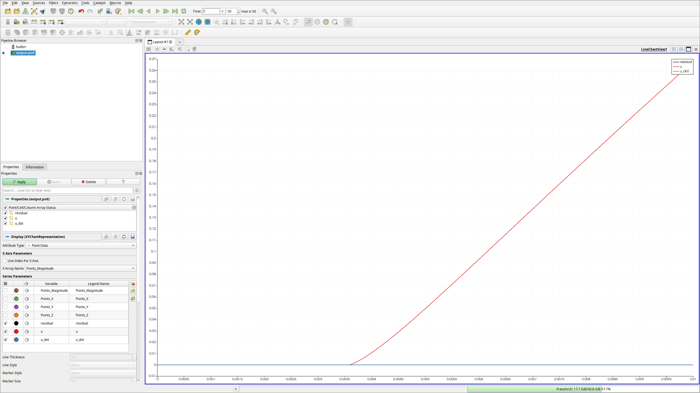

# Tutorial 2: A Quark-Meson model in LPA {#tut2}

Now we will utilize the DiFfRG to solve a Quark-Meson model in LPA. Furthermore, we will show how to use the included python utilities and draw a phase diagram.

You can find the full code as described here also in `Tutorials/tut2`.

# General structure

Setting up the application is analogeous to [Tutorial 1](#tut1), i.e. you create all files and their contents just as there, renaming all instances of `tut1` to `tut2`.

What actually changes is only the system of equations in `model.hh`, i.e. the numerical model.

# Background: The Quark-Meson model in LPA
This section assumes the reader is already familiar with the model. If not, [this](https://arxiv.org/abs/2309.07335) paper and references therein may be helpful.

Consider the effective action for a Quark-Meson model in LPA, given by
\f[\large
  \Gamma_k[\bar q, q, \phi] = \int_x \bigg( \bar q (\partial_\mu\gamma_\mu + i \mu_q \gamma_0)q + \frac{1}{2}(\partial_\mu\phi)^2 + V(\rho) \bigg)\,,
\f]

The flow of the potential can be calculated from this Ansatz as
\f[
  \partial_t V_k(\rho) = \frac{k^4}{4\pi^2}\bigg[
      (N_f^2-1)l_0^{(B,4)}\,(m_\pi^2;T)
      + l_0^{(B,4)}\,(m_\sigma^2;T)\bigg]
      + \frac{k^4}{4\pi^2}\bigg[- 4 N_c N_f l_0^{(F,4)}\,(m_q^2;T,\mu_q)
    \bigg]\,,
\f]
where the threshold functions \f$l_0^{(i,d)}\f$ are given as
\f[
	l_0^{(B,d)}
	= \frac{T}{2k} \sum_{n \in \mathbb{Z}} \int_{x} x^{\frac{d-1}{2}} \partial_t r_\phi(x) G_{\phi,n}(m_\phi^2)
	= \frac{k}{d-1} \frac{\coth \left(\frac{\epsilon_\phi}{2 T}\right)}{\epsilon_\phi}\,,
\f]
\f[
	l_0^{(F,d)}
	= \frac{T}{k} \sum_{n \in \mathbb{Z}} \int_{x} x^{\frac{d-1}{2}} \partial_t r_q(x) G_{q,n}(m_q^2)
	= \frac{k}{2(d-1)} \frac{\tanh \left(\frac{\epsilon_q - \mu_q }{2 T}\right) + \tanh \left(\frac{\epsilon_q + \mu_q}{2 T}\right)}{ \epsilon_q} \,.
\f]

We used flat shape functions
\f[
  r_\phi(x) = (1 / x - 1)\Theta(1-x)\,,\qquad r_q(x) = (1 / \sqrt{x} - 1)\Theta(1-x)\,,\qquad x = p^2 / k^2
\f]

And defined the dispersions
\f[
	\epsilon_i =\sqrt{k_i^2+{ m_i}^2}\,.
\f]

This is all we need to numerically solve the model in the following.

# Numerical model
First, a numerical model has to be defined in `model.hh` with the content
```Cpp
#pragma once

#include <DiFfRG/model/model.hh>
#include <DiFfRG/physics/physics.hh>

using namespace DiFfRG;
```
First things first, we include again everything we need and import all names from the `DiFfRG` namespace.

Then, we set up a parameters struct.
```Cpp
struct Parameters {
  Parameters(const JSONValue &value)
  {
    try {
      Nf = value.get_double("/physical/Nf");
      Nc = value.get_double("/physical/Nc");

      T = value.get_double("/physical/T");
      muq = value.get_double("/physical/muq");

      m2Phi = value.get_double("/physical/m2Phi");
      lambdaPhi = value.get_double("/physical/lambdaPhi");
      hPhi = value.get_double("/physical/hPhi");
    } catch (std::exception &e) {
      std::cout << "Error in reading parameters: " << e.what() << std::endl;
    }
  }
  double Nf, Nc, T, muq, m2Phi, lambdaPhi, hPhi;
};
```
As explained above, the quarks live in the fundamental representation of the color and flavor groups, whereas the pions are in the adjoint representation of the flavor group. Thus all the group structure is defined by setting the number of flavors and colors, which we read in first.
As we are treating a finite temperature and density model, we need `T` (temperature) and `muq` (quark chemical potential). `m2Phi`, `lambdaPhi` are the parameters for the potential at the initial UV scale, `hPhi` is the constant Yukawa coupling which connects mesonic and quark degrees of freedom.

The system consists, as in [Tutorial 1](#tut1) simply of one FE function, `u`, which is in our case
\f[
  u(x) \equiv m^2_\pi(\rho_\phi)\,.
\f]
```Cpp
using FEFunctionDesc = FEFunctionDescriptor<Scalar<"u">>;
using Components = ComponentDescriptor<FEFunctionDesc>;
constexpr auto idxf = FEFunctionDesc{};

namespace tF = fRG::TFLitimSpatial; // use Litim threshold functions

/**
 * @brief This class implements the numerical model for a Quark-Meson model.
 */
class Tut2 : public def::AbstractModel<Tut2, Components>,
             public def::fRG,                  // this handles the fRG time
             public def::FlowBoundaries<Tut2>, // use Inflow/Outflow boundaries
             public def::AD<Tut2>              // define all jacobians per AD
{
```
Additionally, we made a namespace alias `tF` in the above. `DiFfRG::fRG::TFLitimSpatial` contains a few pre-computed threshold functions for the Litim regulator for convenience. The definitions of those can be found, e.g. in [here](https://arxiv.org/abs/1909.02991), Appendix N.

Next, we write the constructor and the initial condition:
```Cpp
private:
  const Parameters prm;

public:
  static constexpr uint dim = 1;

  Tut2(const JSONValue &json) : def::fRG(json.get_double("/physical/Lambda")), prm(json) {}

  template <typename Vector> void initial_condition(const Point<dim> &pos, Vector &values) const
  {
    const auto rhoPhi = pos[0];
    values[idxf("u")] = prm.m2Phi + prm.lambdaPhi / 2. * rhoPhi;
  }
```
Our UV-initial potential is given by
\f[
  V_\textrm{UV} (\rho_\phi) = m^2_\phi \rho_\phi + \frac{\lambda_\Phi}{4} \rho_\phi^2\,.
\f]
Of course, nothing prevents the addition of further parameters, as this is just a LEFT. The reader is encouraged to experiment with higher-order terms for the initial condition.

The main part of the setup is, of course, the flow of \f$u(x)\equiv m^2_\pi(\rho_\phi)\f$ itself:
```Cpp
  template <typename NT, typename Solution> 
  void flux(std::array<Tensor<1, dim, NT>, Components::count_fe_functions(0)> &flux,
            const Point<dim> &pos, const Solution &sol) const
  {
    const auto rhoPhi = pos[0];
    const auto &fe_functions = get<"fe_functions">(sol);
    const auto &fe_derivatives = get<"fe_derivatives">(sol);

    const auto m2Quark = powr<2>(prm.hPhi) * rhoPhi / (prm.Nf);
    const auto m2Pion = fe_functions[idxf("u")];
    const auto m2Sigma = m2Pion + 2. * rhoPhi * fe_derivatives[idxf("u")][0];

    flux[idxf("u")][0] = fluxPion(m2Pion) + fluxSigma(m2Sigma) + fluxQuark(m2Quark);
  }
```
As explained above, we simply have a flux term which fully describes the equation, given as in Tutorial 1 by
\f[
  \partial_t u + \partial_x (F_i(u)) = 0
\f]
and \f$F_i(u)\f$ is the flow of the effective potential \f$V_k(\rho)\f$, as written down above.

Finally, we define the different contributions to the flow of \f$V_k(\rho)\f$ utilizing the pre-implemented Litim regulator threshold functions from `fRG::TFLitimSpatial`:
```Cpp
private:
  template <typename NT> NT fluxSigma(const NT m2Sigma) const { return (k4 * tF::lB<0, NT>(m2Sigma / k2, k, prm.T, 4)) / (4. * powr<2>(M_PI)); }
  template <typename NT> NT fluxPion(const NT m2Pion) const { return (k4 * (powr<2>(prm.Nf) - 1.) * tF::lB<0, NT>(m2Pion / k2, k, prm.T, 4)) / (4. * powr<2>(M_PI)); }
  template <typename NT> NT fluxQuark(const NT m2Quark) const { return -((k4 * prm.Nc * prm.Nf * tF::lF<0, NT>(m2Quark / k2, k, prm.T, prm.muq, 4)) / powr<2>(M_PI)); }
};
```

# Running the program

The parameter file first looks identically to the one used in Tutorial 1, but we have to make a few changes.
First of all, the `physical` section is of course different:
```JSON
{
  "physical": {
    "Lambda" : 0.6,
    "Nf" : 2.0,
    "Nc" : 3.0,

    "T" : 0.01,
    "muq" : 0.0,

    "m2Phi" : 0.0,
    "lambdaPhi" : 72.0,
    "hPhi" : 7.2
  },
  ...
```
Of course, this just defines all the parameters we decided to read in at the beginning of this tutorial.
Secondly, we need to choose an appropriate field space size. For the above parameters, a possible choice would be
```JSON
    "grid": {
      "x_grid": "0:5e-5:5e-3, 5e-3:1e-3:1e-2",
      ...
```

We now set up the build by
```bash
$ mkdir build
$ cd build
$ cmake -DCMAKE_BUILD_TYPE=Release -DCMAKE_CXX_FLAGS='-O3 -march=native -ffast-math -fno-finite-math-only' ..
```

At this point, we can build and run the program.
```bash
$ make
$ ./tut2 -si /output/verbosity=1
```

Again, you can investigate this in paraview:
```bash
$ paraview output.pvd
```
{html: width=80%, latex: width=5cm}

# Drawing a phase diagram

Of course, we can now start to modify parameters. Either you can just edit `parameters.json`, write a new JSON file, or you can use the overwriting syntax.
As an example, consider you want to run a simulation at muq = 0.25, T = 0.1, Nc = 4 and name it `simulation4`. This can be achieved by the command
```bash
$ ./tut2 -sd /physical/muq=0.25 -sd /physical/T=0.1 -sd /physical/Nc=4.0 -ss /output/name=simulation4
```

Of course, scanning the phase diagram of the Quark-Meson model like this is too tedious. For automating the task, we suggest to use the `adapative` python package.